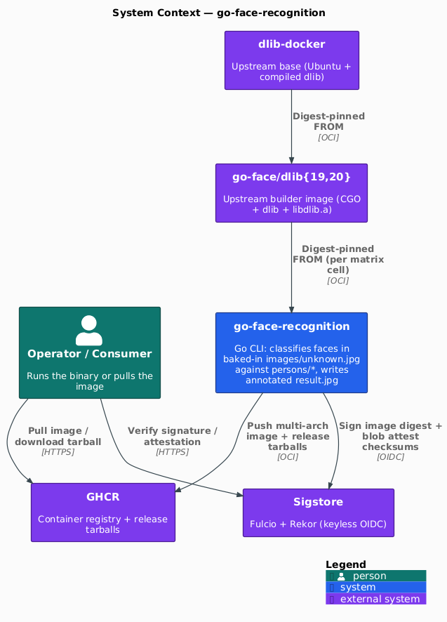
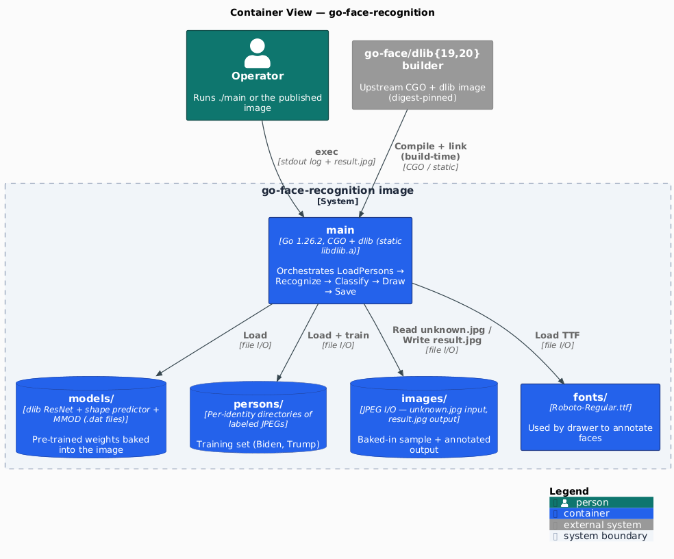
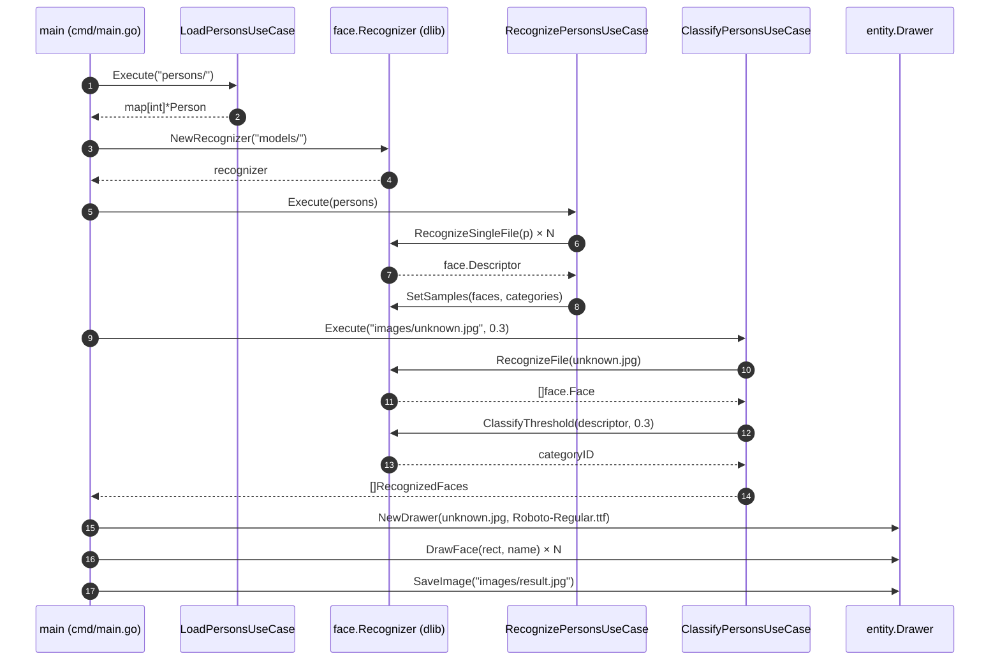

[](https://github.com/AndriyKalashnykov/go-face-recognition/actions/workflows/ci.yml)
[](https://hits.sh/github.com/AndriyKalashnykov/go-face-recognition/)
[](https://opensource.org/licenses/MIT)
[](https://app.renovatebot.com/dashboard#github/AndriyKalashnykov/go-face-recognition)

# Go Face Recognition

A **hardened, multi-architecture face recognition CLI** in Go, built on [dlib](http://dlib.net/)'s [FaceNet](https://arxiv.org/abs/1503.03832) implementation via CGo. It's the canonical **end-to-end worked example** of a three-repo build chain that also maintains [`dlib-docker`](https://github.com/AndriyKalashnykov/dlib-docker) and [`go-face`](https://github.com/AndriyKalashnykov/go-face) — every layer is digest-pinned, cosign-signed, and CI-verified across `linux/amd64 + linux/arm64 + linux/arm/v7` before publish.

**What it does.** Loads a directory of labeled training images (`persons/Alice/*.jpg`, `persons/Bob/*.jpg`), initializes a dlib ResNet recognizer + shape-predictor + MMOD face-detector from `models/*.dat`, then detects and classifies faces in `images/unknown.jpg`, annotates the input with each recognized name, and writes `images/result.jpg`. The repo ships with working baked-in test data and models so `./main` runs without additional configuration — see [`cmd/main.go`](cmd/main.go) for the ~80 lines that wire it together, and [Usage](#usage) below for how to plug in your own data.

**Two ways to consume this project:**

1. **Run a pre-built binary from a GitHub Release** (easiest, no Docker required). Every tagged release publishes **six statically-linked binary tarballs** — one per `(dlib lineage × target architecture)` combination, with a cosign-signed `checksums.txt` so verification needs no pre-shared key. Extract, run `./main`, done. Jump to [Release artifacts (pre-built binaries)](#release-artifacts-pre-built-binaries).
2. **Pull a pre-built multi-arch container image from GHCR.** Every tagged release publishes signed multi-arch images at `ghcr.io/andriykalashnykov/go-face-recognition:<tag>` (primary `dlib20` lineage) and `:<tag>-dlib19` (secondary `dlib19` lineage). Jump to [Verifying a published image signature](#verifying-a-published-image-signature) for the cosign verification snippet.

The [Quick Start](#quick-start) section below covers both consumption paths plus the developer path (clone + `make build`) in three short snippets.

**Position in the image-build chain.** This repo is the top layer of a three-repo chain maintained by the same author:

```text
ghcr.io/andriykalashnykov/dlib-docker:<dlib-version>
  ↓  (digest-pinned FROM)
ghcr.io/andriykalashnykov/go-face/dlib<major>:<go-face-version>
  ↓  (digest-pinned FROM, per CI matrix cell)
ghcr.io/andriykalashnykov/go-face-recognition:<app-version>         ← this repo
```

[`dlib-docker`](https://github.com/AndriyKalashnykov/dlib-docker) provides an Ubuntu base image with dlib compiled from source, including a PIC-safe static archive (`libdlib.a`) that the binary in this repo links against. [`go-face`](https://github.com/AndriyKalashnykov/go-face) adds the Go toolchain and CGo bindings on top, publishing one image per active dlib major lineage. This repo (`go-face-recognition`) is the actual application — see [Architecture](#architecture) for the full block diagram of the chain, what each layer provides, and which bug classes live at which layer.

## What this project adds beyond a baseline dlib CGo demo

- **Multi-architecture CI matrix** across every supported upstream `go-face` dlib major lineage (currently `dlib19` + `dlib20`) × every supported platform (`linux/amd64`, `linux/arm64`, `linux/arm/v7`). Six build cells per tag push, all running in parallel with independent GHA cache scopes.
- **Hardened image publishing pipeline** — five pre-push gates per matrix cell (build, Trivy image scan, smoke test, multi-arch build, cosign keyless OIDC sign) with `fail-fast: false` so one broken lineage doesn't block the others. See [Pre-push image hardening](#pre-push-image-hardening).
- **Dual distribution channel** — signed multi-arch container images on GHCR **and** statically-linked binary tarballs on GitHub Releases. Both distribution formats are cosign-signed with the same keyless OIDC chain of trust, so consumers can verify provenance without any pre-shared key.
- **Deterministic reproducible release tarballs** built with `tar --sort=name --mtime=@0 --owner=0 --group=0 | gzip -n`, so downstream consumers can re-extract from the published image digest and verify `sha256` matches byte-for-byte. Useful for packagers, distro maintainers, and anyone who wants to prove the binary they're running came from the exact image they audited.
- **Full local test scaffold** — unit tests (host-runnable, 98.4% statement coverage on the pure-Go `internal/entity` package), integration tests (`//go:build integration`, real dlib classify/recognize pipeline against baked-in models), end-to-end smoke, and **`make image-verify`** that mirrors the CI docker job's per-lineage gates locally before pushing. The structural pre-push gate that closes the "I ran `make -n image-build` and called it verified" failure mode documented in [`CLAUDE.md`](CLAUDE.md).
- **Scheduled upstream lineage discovery** via [`.github/workflows/discover-go-face-lineages.yml`](.github/workflows/discover-go-face-lineages.yml) — weekly scan of upstream `ghcr.io/andriykalashnykov/go-face/dlib*` with automatic discovery-issue creation (no auto-PR, no auto-merge — chain of trust preserved for the maintainer to review) when a new dlib major lineage appears upstream.
- **Four first-class Dockerfiles** covering different build strategies: primary production (`Dockerfile.go-face`, used by CI), self-contained Ubuntu builder (`Dockerfile.ubuntu.builder`), minimal alpine runtime (`Dockerfile.alpine.runtime`), and skip-go-face alternative (`Dockerfile.dlib-docker-go`). All four are hadolint-clean, use pinned base image digests with `--no-install-recommends` + apt cleanup, ship SHA256 verification on Go tarball downloads, and have been end-to-end verified on amd64 + arm64 + arm/v7. See [Dockerfiles](#dockerfiles).

## Tech Stack

| Component | Technology |
|-----------|------------|
| Language | Go 1.26.2 (CGO enabled, version derived from `go.mod`, kept fresh by Renovate) |
| Face recognition engine | [dlib](http://dlib.net/) ResNet via [`AndriyKalashnykov/go-face`](https://github.com/AndriyKalashnykov/go-face) CGo bindings |
| Image annotation | `golang.org/x/image` (OpenType font rendering, RGBA drawing) |
| Base builder image | `ghcr.io/andriykalashnykov/go-face/dlib{19,20}:<tag>@<digest>` — one per active dlib major lineage, pinned in `.github/workflows/ci.yml` matrix |
| Binary link model | **Fully static** — `-extldflags -static` + `static_build` tag, linking `libdlib.a` from the dlib-docker layer. No runtime `.so` dependency on dlib. |
| Published container images | `ghcr.io/andriykalashnykov/go-face-recognition:<tag>` (dlib20 primary) + `:<tag>-dlib19` (secondary), multi-arch (`linux/amd64` + `linux/arm64` + `linux/arm/v7`) |
| Published release artifacts | Six binary tarballs per tag (2 lineages × 3 archs) + signed `checksums.txt.sigstore.json`, all attached to the GitHub Release |
| Image signing | [Cosign](https://docs.sigstore.dev/cosign/overview/) keyless OIDC (Sigstore Fulcio → Rekor, tag-pushes only) — both images and release tarball checksums |
| Runtime image user | Non-root UID `10001` in a non-root `app` group (K8s restricted-pod-security compatible) |
| CI / CD | GitHub Actions — matrix `docker` + `release-artifacts-extract` + `release-artifacts-publish` jobs, all `needs:`-chained on tag push |
| Static analysis | golangci-lint (gosec, gocritic, errorlint, bodyclose, noctx, misspell, goconst), hadolint, actionlint, shellcheck |
| Security scanning | gitleaks (secrets), Trivy (filesystem + image), govulncheck (Go CVEs, Docker CI only) |
| Testing | `go test` (unit, host), `go test -tags integration` (real dlib pipeline, inside builder), `make e2e` (binary smoke), `make image-verify` (per-lineage CI equivalent) |
| Dependency updates | Renovate (branch automerge, squash) + scheduled upstream lineage discovery workflow |

## Prerequisites

| Tool | Version | Purpose |
|------|---------|---------|
| [GNU Make](https://www.gnu.org/software/make/) | 3.81+ | Build orchestration |
| [Go](https://go.dev/dl/) | 1.26.2 | Language runtime (CGO enabled) |
| [Git](https://git-scm.com/) | 2.0+ | Version control |
| [Docker](https://www.docker.com/) | latest | Container builds and runtime |
| [golangci-lint](https://golangci-lint.run/) | 2.11.4 | Go linters (auto-installed by `make deps`) |
| [hadolint](https://github.com/hadolint/hadolint) | 2.14.0 | Dockerfile linting (auto-installed by `make deps-hadolint`) |
| [actionlint](https://github.com/rhysd/actionlint) | 1.7.12 | GitHub Actions workflow linting (auto-installed by `make deps-actionlint`) |
| [shellcheck](https://github.com/koalaman/shellcheck) | 0.11.0 | Shell script linting (auto-installed by `make deps-shellcheck`) |
| [gitleaks](https://github.com/gitleaks/gitleaks) | 8.30.1 | Secret scanning (auto-installed by `make deps-gitleaks`) |
| [Trivy](https://trivy.dev/) | 0.69.3 | Filesystem/image security scanning (auto-installed by `make deps-trivy`) |
| [govulncheck](https://pkg.go.dev/golang.org/x/vuln/cmd/govulncheck) | 1.2.0 | Go module vulnerability scanning (auto-installed by `make deps-govulncheck`) |
| [act](https://github.com/nektos/act) | 0.2.87 | Run GitHub Actions locally (optional) |

Install Go tool dependencies:

```bash
make deps
```

### Linux system C development headers (required for CGO build)

Because go-face links against dlib and friends via CGO, local `make lint`, `make test`, and `make build` require the following Debian/Ubuntu packages in addition to `make deps`:

```bash
sudo apt-get install -y \
    libjpeg-dev libdlib-dev libopenblas-dev libblas-dev \
    libatlas-base-dev liblapack-dev gfortran libpng-dev
```

If these headers are missing, tools like `golangci-lint` and `govulncheck` will fail with `fatal error: jpeglib.h: No such file or directory`. On hosts without the headers, use `make image-build` / `make ci-run` — the Docker builder image bundles the full toolchain.

## Quick Start

Three ways to get this running, from least-setup-required to most:

### 1. Download a pre-built binary (no Docker, no Go toolchain)

```bash
curl -fsSLO "https://github.com/AndriyKalashnykov/go-face-recognition/releases/latest/download/go-face-recognition_<version>_linux_arm64.tar.gz"
sha256sum -c checksums.txt --ignore-missing
tar -xzf go-face-recognition_<version>_linux_arm64.tar.gz
./main
```

See [Release artifacts (pre-built binaries)](#release-artifacts-pre-built-binaries) below for full cosign verification.

### 2. Pull a multi-arch container image

```bash
docker run --rm ghcr.io/andriykalashnykov/go-face-recognition:latest /app/main
```

Docker picks the right per-platform manifest (`amd64` / `arm64` / `arm/v7`) automatically. To pin against the legacy `dlib19` lineage instead of the default `dlib20`, append `-dlib19` to the tag: `ghcr.io/andriykalashnykov/go-face-recognition:latest-dlib19`. Every published `tag@digest` is cosign-signed — see [Verifying a published image signature](#verifying-a-published-image-signature).

### 3. Develop on this repo

```bash
make deps          # verify required tools (lazily installs most of them)
make test          # run host unit tests (pure Go, 98.4% coverage on internal/entity)
make test-docker   # run the full internal/... unit-test suite inside the builder image (CGO+dlib)
make e2e           # build Dockerfile.go-face and smoke-test the binary locally
make image-verify  # build + smoke against every CI matrix lineage pin (pre-push gate)
```

See [Available Make Targets](#available-make-targets) below for the full list.

## Architecture

This project is the top of a three-repo image-build chain. Each upstream repo
publishes a container image to GHCR; each downstream repo pulls the layer
above as an immutable digest-pinned builder base. A bug at any layer
propagates downwards until it's fixed at the root, so understanding the
chain is essential before making changes that touch linking, CGo flags,
or base image versions.

<p align="center"></p>

Source: [`docs/diagrams/c4-context.puml`](docs/diagrams/c4-context.puml) — rendered via `make diagrams`.

### Container view

The image is a single static binary plus baked-in training + model data. Nothing is loaded from outside the image at runtime:

<p align="center"></p>

Source: [`docs/diagrams/c4-container.puml`](docs/diagrams/c4-container.puml).

### Classification pipeline

The binary is a single synchronous process. This is the end-to-end sequence `cmd/main.go` executes:



```text
┌──────────────────────────────────────────────────────────────────────┐
│  AndriyKalashnykov/dlib-docker          (this project's grandparent) │
│  https://github.com/AndriyKalashnykov/dlib-docker                    │
│                                                                      │
│  Ubuntu noble + apt{cmake,blas,lapack,jpeg,…} + `davisking/dlib`     │
│  built from source via `cmake -DBUILD_SHARED_LIBS={ON,OFF}` (two     │
│  passes, so /usr/local/lib ships BOTH libdlib.so AND libdlib.a       │
│  for downstream static linking). Exports ENV LIBRARY_PATH=/usr/local │
│  /lib so downstream `ld -ldlib` resolves the static archive.         │
│                                                                      │
│  Publishes:                                                          │
│    ghcr.io/andriykalashnykov/dlib-docker:19.24.9                     │
│    ghcr.io/andriykalashnykov/dlib-docker:20.0.1                      │
└───────────────────────────┬──────────────────────────────────────────┘
                            │ FROM (digest-pinned)
                            ▼
┌──────────────────────────────────────────────────────────────────────┐
│  AndriyKalashnykov/go-face              (this project's parent)      │
│  https://github.com/AndriyKalashnykov/go-face                        │
│                                                                      │
│  dlib-docker + Go toolchain (version extracted from go.mod) + the    │
│  go-face CGo bindings source tree copied into /app. Matrix-built    │
│  against every `active` dlib lineage defined in `.dlib-versions.     │
│  json`; one image per lineage is published with a suffix.            │
│                                                                      │
│  Publishes:                                                          │
│    ghcr.io/andriykalashnykov/go-face/dlib19:0.1.4                    │
│    ghcr.io/andriykalashnykov/go-face/dlib20:0.1.4                    │
└───────────────────────────┬──────────────────────────────────────────┘
                            │ FROM (digest-pinned, per CI matrix cell)
                            ▼
┌──────────────────────────────────────────────────────────────────────┐
│  AndriyKalashnykov/go-face-recognition  (this repo)                  │
│  https://github.com/AndriyKalashnykov/go-face-recognition            │
│                                                                      │
│  The actual application: uses go-face to detect + classify faces     │
│  against baked-in `persons/` and `images/unknown.jpg`, annotates     │
│  the output via `internal/entity/drawer.go`, and writes              │
│  `images/result.jpg`. Built as a fully-static binary                 │
│  (`-extldflags -static` + `static_build` tag) linking against        │
│  libdlib.a from the layer above, then COPYed into a minimal          │
│  alpine runtime stage running as non-root UID 10001.                 │
│                                                                      │
│  CI matrix builds + publishes against every go-face dlib lineage:    │
│    ghcr.io/andriykalashnykov/go-face-recognition:<tag>               │
│    ghcr.io/andriykalashnykov/go-face-recognition:<tag>-dlib19        │
└──────────────────────────────────────────────────────────────────────┘
```

**What each layer owns:**

| Layer | Provides | Bug class that lives here |
|-------|----------|---------------------------|
| dlib-docker | C++ dlib source build, BLAS/LAPACK/JPEG system libraries, `libdlib.{so,a}` in `/usr/local/lib`, `LIBRARY_PATH` env | Missing static archive, cmake flags, BLAS variant selection, apt package drift |
| go-face | Go toolchain, go-face CGo source tree, dlib headers + libs inherited from dlib-docker | Go version mismatch, CGo flag regressions, testdata drift |
| go-face-recognition | Application code, Dockerfile.go-face (static-link build), CI matrix over go-face lineages, cosign signing, image publishing | Linker flag drift, runtime image hardening, classification logic |

**Rebuilding the chain after an upstream change:** bump the digest pin in the
downstream repo (ci.yml / Makefile / Dockerfile ARG default), verify locally
with `make image-verify` or `make e2e`, then commit. Renovate's
`go-face builder images` group rule collapses all the lineage bumps across
this chain into a single PR so the pin drift stays auditable.

### Project Structure

```text
cmd/             # Application entry point (main.go)
internal/
  entity/        # Domain entities (person, drawer) — pure Go, no CGO
  usecases/      # Business logic (load, classify, recognize persons)
images/          # Input/output images for recognition
persons/         # Person directories with face images for training
models/          # Trained facial recognition models
fonts/           # Fonts for image annotation
```

### Dockerfiles

This repo ships four Dockerfiles, each targeting a different build strategy.
`Dockerfile.go-face` is the canonical production path used by the CI publish
matrix; the other three are **alternative build paths** kept as first-class
maintained artifacts for scenarios where the primary path isn't what you
want. All four produce the same functional end-state — a statically-linked
binary that classifies faces in `images/unknown.jpg` against `persons/`.

| Dockerfile | Purpose | Base image (starts from) | libdlib source | Used by |
|------------|---------|--------------------------|----------------|---------|
| **`Dockerfile.go-face`** | **Primary** production build. The CI matrix publishes multi-arch GHCR images from this file, one per dlib lineage. Hardened for K8s restricted-pod-security (non-root UID 10001). | `ghcr.io/andriykalashnykov/go-face/dlib{19,20}:<tag>@<digest>` — upstream go-face image (dlib-docker + Go + go-face CGo source tree) | Inherited from upstream `go-face` (→ dlib-docker → from-source dlib build) | `.github/workflows/ci.yml` docker matrix, `make image-build`, `make e2e`, `make image-verify` |
| **`Dockerfile.ubuntu.builder`** | **Self-contained alternative builder.** Installs dlib via Ubuntu's stock `libdlib-dev` apt package and builds Go from go.dev with SHA256 verification. Useful when you want to reproduce a build without depending on the upstream `dlib-docker`/`go-face` image chain at all. Produces a dev sandbox container (`tail -f /dev/null`) with the baked-in binary for interactive debugging. | `ubuntu:noble-20260324@<digest>` (pinned) | Ubuntu apt `libdlib-dev` package (currently dlib 19.24.0 on noble — older than the dlib-docker chain's 20.0.1 but self-consistent) | `make image-build` → `:latest-builder` |
| **`Dockerfile.alpine.runtime`** | **Minimal alpine runtime slice** over a locally-built builder image. Copies the compiled binary + test data out of the `BUILDER_IMAGE` (default: `:latest-builder` from `Dockerfile.ubuntu.builder`) into a fresh `alpine:3.23.3` stage running as non-root UID 10001. Use this to produce a small (~130 MB content size) deployable runtime image after running `Dockerfile.ubuntu.builder`. | `alpine:3.23.3@<digest>` (pinned) + `BUILDER_IMAGE` via `COPY --from` | Inherited from `BUILDER_IMAGE` | `make image-build` → `:latest-runtime` |
| **`Dockerfile.dlib-docker-go`** | **Skip-go-face alternative.** Builds directly on `dlib-docker` (one layer shallower than `Dockerfile.go-face`), installing Go at build time. Useful for reproducible builds that only depend on one upstream repo, or when exercising dlib-docker changes without round-tripping through the go-face image. Produces the same non-root alpine runtime as `Dockerfile.go-face`. | `ghcr.io/andriykalashnykov/dlib-docker:<tag>@<digest>` (pinned) | Inherited from dlib-docker (→ from-source dlib build via cmake) | `make image-build` → `:latest-dlib-docker-go` |

**Quality invariants (enforced by `hadolint` + `trivy-fs` on every commit):**
all four Dockerfiles use pinned base-image digests, `--no-install-recommends`
on apt installs with `/var/lib/apt/lists/*` cleanup, SHA256 verification on
Go tarball downloads, OCI image labels, and a non-root runtime `USER`. All
four have been end-to-end verified on `linux/amd64` (both the build and
running the compiled binary against the baked-in test data).

**When to use which:**

- **Production / CI publishes:** always `Dockerfile.go-face` — it's the only
  one whose CI publishes multi-arch signed images to GHCR.
- **Local dev sandbox without GHCR dependency:** `Dockerfile.ubuntu.builder`
  gives you a ubuntu-based container with the binary baked in. No need to
  pull the upstream `go-face` or `dlib-docker` images.
- **Small runtime deployable after ubuntu builder:** `Dockerfile.alpine.runtime`
  over `Dockerfile.ubuntu.builder`. Matches the size profile of the
  `Dockerfile.go-face` runtime stage.
- **Testing dlib-docker changes end-to-end:** `Dockerfile.dlib-docker-go`
  bypasses the go-face intermediate so dlib-docker pin bumps can be
  exercised in isolation.

### References

- **FaceNet** — [FaceNet: A Unified Embedding for Face Recognition and Clustering](https://arxiv.org/abs/1503.03832) (Google, 2015). Deep neural network that learns a mapping from facial images to a compact Euclidean space, where distances between embeddings correspond directly to a measure of facial similarity. This project is based on FaceNet principles.
- **dlib** — [dlib.net](http://dlib.net/). Modern C++ toolkit containing machine learning algorithms and tools for creating complex software in C++ to solve real-world problems. Renowned for its robustness, efficiency, and versatility in computer vision, machine learning, and artificial intelligence.

## Usage

### Dynamic Loading of People

This project dynamically loads people from within the `persons/` directory. Each person should have a subfolder with the person's name, containing images of that person to be used in the model. It is ideal to provide more than one image per person to improve classification accuracy. The images provided for each person should contain only one face, which is the face of the person.

### Recognition of Faces

After loading the people, the software reads an image from the `images/` directory. By default, it searches for an image named `unknown.jpg`. It then recognizes the faces in the image based on the provided people. The input image can contain multiple people, and the software attempts to recognize all of them.

### Output Generation

The output of the system is a new image with the faces marked and the name of each identified person. The generated image will be saved in the `images/` directory with the name `result.jpg`.

## Build & Package

### Building on macOS

Install OpenBLAS etc:

```bash
brew tap messense/macos-cross-toolchains
brew install aarch64-unknown-linux-musl
brew install messense/macos-cross-toolchains/aarch64-unknown-linux-gnu
brew link openblas 2>&1
```

Install dlib:

```bash
brew install cmake
git clone https://github.com/davisking/dlib.git
cd dlib
mkdir build
cd build
cmake ..
cmake --build . --config Release
sudo make install
```

Build and run:

```bash
make build-arm64
./cmd/main
```

## Available Make Targets

Run `make help` to see all available targets.

### Build & Run

| Target | Description |
|--------|-------------|
| `make build` | Build Go binary for Linux amd64 |
| `make build-arm64` | Build Go binary natively for macOS arm64 |
| `make run` | Run the application locally |
| `make clean` | Remove build artifacts and generated files |

### Testing

Three-layer test pyramid plus matrix verification:

| Target | Description |
|--------|-------------|
| `make test` | Unit tests on host, scoped to `internal/entity` (pure Go, no CGO) — seconds, 98.4% coverage |
| `make test-docker` | Full `internal/...` unit-test suite inside the builder image (CGO+dlib) — seconds |
| `make integration-test` | `//go:build integration` tests inside the builder image — real dlib classify/recognize pipeline + error-branch coverage against baked-in `models/`, `persons/`, `images/unknown.jpg`. Tens of seconds, requires Docker |
| `make e2e` | Build `Dockerfile.go-face` against the primary `BUILDER_IMAGE` lineage and run the compiled binary; asserts face count, identity classification, and `result.jpg` artefact |
| `make e2e-compose` | Run the pipeline through `docker-compose.yml` (`Dockerfile.dlib-docker-go` path) — catches compose wiring drift that `make e2e` does not |
| `make image-verify` | Build + smoke test `Dockerfile.go-face` against **every** CI matrix lineage pin (the local equivalent of the CI docker job's GATE 1 + GATE 3 per cell). **Run this before every push that touches `Dockerfile.go-face`, the `ci.yml` matrix, or any `BUILDER_*` variable** |
| `make coverage-check` | Fail if total unit-test coverage falls below 80% |

### Code Quality

| Target | Description |
|--------|-------------|
| `make format` | Auto-format Go source code (gofmt + goimports via `golangci-lint fmt`) |
| `make format-check` | Fail if any file needs formatting (CI gate; non-mutating) |
| `make lint` | Run golangci-lint (gosec, gocritic, errorlint, bodyclose, noctx, misspell, goconst) and hadolint on all Dockerfiles |
| `make lint-ci` | Lint GitHub Actions workflows with actionlint + shellcheck |
| `make mermaid-lint` | Parse every ` ```mermaid ` block in markdown files via pinned `minlag/mermaid-cli` — fail on render errors |
| `make diagrams` | Render `docs/diagrams/*.puml` → `docs/diagrams/out/*.png` via pinned `plantuml/plantuml` |
| `make diagrams-clean` | Remove rendered diagram artefacts (`docs/diagrams/out/`) |
| `make diagrams-check` | CI drift gate: fails if committed PlantUML output no longer matches `.puml` source |
| `make secrets` | Scan for hardcoded secrets with gitleaks |
| `make trivy-fs` | Scan filesystem for vulnerabilities, secrets, and misconfigurations |
| `make vulncheck` | Check for known vulnerabilities in Go dependencies (requires C toolchain) |
| `make vulncheck-docker` | Run govulncheck inside the builder image (bypasses host CGO/dlib requirement) |
| `make static-check` | Composite quality gate (`lint-ci`, `lint`, `secrets`, `trivy-fs`, `mermaid-lint`, `diagrams-check`, `deps-prune-check`) |
| `make update` | Update dependency packages to latest versions and run `make ci` |

### Docker

| Target | Description |
|--------|-------------|
| `make image-bootstrap` | Create Docker buildx multi-platform builder (idempotent) |
| `make image-build` | Build Docker images via buildx (uses `IMAGE_TAG`, defaults to current tag) |
| `make image-run-runtime` | Run runtime image interactively |
| `make image-run-go-face` | Run go-face image interactively |
| `make image-prune` | Prune Docker system and buildx cache |
| `make image-setup-multiarch` | Install binfmt handlers for multi-arch Docker |
| `make image-run-ghcr-amd64` | Run GHCR runtime image on amd64 |
| `make image-run-ghcr-arm64` | Run GHCR runtime image on arm64 |

### CI

| Target | Description |
|--------|-------------|
| `make ci` | Run the full CI pipeline locally (deps, format-check, static-check, test, coverage-check, build) |
| `make ci-run` | Run GitHub Actions workflow locally using [act](https://github.com/nektos/act) |

### Dependencies

| Target | Description |
|--------|-------------|
| `make deps` | Verify required tool dependencies |
| `make deps-act` | Install act for local CI |
| `make deps-hadolint` | Install hadolint for Dockerfile linting |
| `make deps-shellcheck` | Install shellcheck for shell script linting |
| `make deps-actionlint` | Install actionlint for GitHub Actions workflow linting |
| `make deps-gitleaks` | Install gitleaks for secret scanning |
| `make deps-trivy` | Install Trivy for filesystem and image security scanning |
| `make deps-govulncheck` | Install govulncheck for Go module vulnerability scanning |
| `make deps-prune-check` | Verify go.mod and go.sum are tidy |

### Release

| Target | Description |
|--------|-------------|
| `make release` | Create and push a new semver tag |
| `make tag-delete` | Delete a specific tag locally and remotely |
| `make version` | Print current version (tag) |

### Utilities

| Target | Description |
|--------|-------------|
| `make help` | List available targets |
| `make renovate-bootstrap` | Install mise and Node (per `.mise.toml`) for Renovate |
| `make renovate-validate` | Validate Renovate configuration |

## CI/CD

GitHub Actions runs on every push to `main`, tags `v*`, and pull requests.

| Workflow | Triggers | Summary |
|----------|----------|---------|
| **ci** (`static-check` + `test` + `integration-test` + `e2e-compose` jobs) | push, PR | Host-runnable gates. `static-check` runs `lint-ci` + `secrets` + `trivy-fs`; `test` runs host unit tests; `integration-test` runs `//go:build integration` inside the builder image; `e2e-compose` exercises `docker-compose.yml`. Gate the `docker` job via `needs:`. |
| **ci** (`docker` job) | push, PR, tags | `strategy.matrix` over every supported upstream `go-face` dlib major lineage (currently `dlib19` + `dlib20`). Each matrix cell runs the full seven-gate hardening pipeline (build + Trivy image scan + smoke test + container-structure-test + multi-arch build + cosign signing + SBOM attestation) independently with its own GHA cache scope. Publishes multi-arch image (amd64, arm64, arm/v7) to GHCR on tag pushes only. |
| **ci** (`ci-pass` aggregator) | push, PR, tags | `if: always()`, `needs:` every upstream job. Branch protection references this job only — matrix-cell renames can't silently bypass protection. |
| **ci** (`release-artifacts-extract` + `release-artifacts-publish` jobs) | tag pushes only | `needs: [docker]`. Extracts `/app/main` + `fonts/` + `models/` + `persons/` + `images/` from every per-platform manifest of every lineage image, packages each as a deterministic reproducible tarball (`tar --sort=name --mtime=@0 --owner=0 --group=0 \| gzip -n`), produces `checksums.txt` covering all six tarballs, cosign-blob-signs it with keyless OIDC (same chain of trust as the image signing), creates the GitHub Release if missing, and uploads everything. See "Release artifacts" below. |
| **cleanup-runs** | weekly (Sunday 00:00 UTC), `workflow_dispatch` | Remove old workflow runs via native `gh` CLI |
| **discover-go-face-lineages** | weekly (Monday 06:00 UTC), `workflow_dispatch` | Scan upstream `ghcr.io/andriykalashnykov/go-face/dlib*` via the anonymous Docker Registry v2 token flow, diff against the lineages currently pinned in `ci.yml`, and open one idempotent discovery issue per new lineage with the latest semver tag + immutable manifest digest pre-filled. Cites the "Adding a new go-face dlib lineage" playbook in [`CLAUDE.md`](CLAUDE.md). No auto-PR or auto-merge — chain of trust preserved. |

Build and test happen inside the Docker multi-stage build (CGO/dlib dependencies are only available in the builder image).

The `docker` job authenticates to GHCR using the built-in `GITHUB_TOKEN` — no additional repository secret is required. The **primary** lineage (`dlib20`) owns the unsuffixed bare-semver Docker tags (`1.2.3`, `1.2`, `1`, `latest`) derived from the `v`-prefixed git tag. **Non-primary** lineages publish suffixed tags (e.g. `1.2.3-dlib19`, `1.2-dlib19`, `latest-dlib19`) so consumers can explicitly target an older dlib ABI when needed. Cosign signs each `tag@digest` per lineage.

### Pre-push image hardening

Each cell of the `docker` job's dlib lineage matrix runs the following gates **before** any image is pushed to GHCR. Any failure in any cell blocks the release (`fail-fast: false` so dlib19 and dlib20 fail independently); regressions in cross-compile targets or in either upstream lineage surface on the commit that introduced them, not on release day. Each cell uses its own GHA cache scope (`dlib19` / `dlib20`) so layers don't evict each other, and its own scan/smoke-test container names so concurrent cells don't collide.

| # | Gate | Catches | Tool |
|---|------|---------|------|
| 1 | Build single-arch image locally | Build regressions on the runner architecture | `docker/build-push-action` with `load: true` |
| 2 | **Trivy image scan** (CRITICAL/HIGH blocking) | CVEs in the base image, OS packages, build layers, leaked secrets, Dockerfile misconfigs | `aquasecurity/trivy-action` with `image-ref:` |
| 3 | **Smoke test** | Image actually works — boots the CLI binary and runs the face-recognition pipeline against baked-in test data; exit 0 means dlib loaded, the recognizer initialised, and `result.jpg` was written | `docker run --entrypoint /app/main` |
| 3b | **container-structure-test** | Runtime contract: entrypoint shape, OCI labels, non-root UID `10001`, `/app` subtree present, statically-linked ELF | `GoogleContainerTools/container-structure-test` with `container-structure-test.yaml` |
| 4 | Multi-arch build + conditional push | `linux/amd64`, `linux/arm64`, and `linux/arm/v7` cross-compile regressions. On tag push: publishes to GHCR. On non-tag push: validation-only. | `docker/build-push-action` with `push: ${{ startsWith(github.ref, 'refs/tags/') }}` |
| 5 | **Cosign keyless OIDC signing** (tag push only) | Unsigned or tampered images — every published tag gets a Sigstore signature on the manifest digest, verifiable without any long-lived key material | `sigstore/cosign-installer` + `cosign sign --yes <tag>@<digest>` |
| 6 | **SBOM attestation** (tag push only) | Supply-chain transparency — SPDX SBOM generated from the image digest and attached as a Sigstore attestation (out-of-band, keeps GHCR "OS / Arch" tab clean). Verify with `cosign verify-attestation --type spdxjson` | `anchore/sbom-action/download-syft` + `cosign attest --type spdxjson` |

Buildkit in-manifest attestations (`provenance`, `sbom`) are deliberately disabled so the OCI image index stays free of `unknown/unknown` platform entries — this lets the GHCR Packages UI render the **"OS / Arch"** tab correctly on the package overview page. Supply-chain verification comes from cosign signing, not from in-manifest SLSA attestations.

Runtime Dockerfiles (`Dockerfile.go-face`, `Dockerfile.dlib-docker-go`, `Dockerfile.alpine.runtime`) run as numeric UID `10001` in a non-root `app` group (K8s restricted-pod-security compatible). Every runtime stage also runs `apk --no-cache upgrade` as its first layer to pick up security patches published between alpine image cuts.

#### Verifying a published image signature

```bash
cosign verify ghcr.io/andriykalashnykov/go-face-recognition:<tag> \
  --certificate-identity-regexp 'https://github\.com/AndriyKalashnykov/go-face-recognition/.+' \
  --certificate-oidc-issuer https://token.actions.githubusercontent.com
```

Expected output: a JSON certificate chain ending in `"issuer": "https://token.actions.githubusercontent.com"` with `"Subject"` pointing at the `AndriyKalashnykov/go-face-recognition` workflow. Any tampering with the image after publish invalidates the signature.

### Release artifacts (pre-built binaries)

Every tagged release also publishes **pre-built binary tarballs** to the
[GitHub Releases](https://github.com/AndriyKalashnykov/go-face-recognition/releases)
page alongside the container images. This is for users who want to run
`go-face-recognition` directly on a host (e.g. a Raspberry Pi) without
installing Docker, and for packagers who want a reproducible artifact to
redistribute.

**What's in a release.** Six tarballs per tag — one per `(dlib lineage ×
target architecture)` combination — plus a signed checksum file:

```text
go-face-recognition_<version>_linux_amd64.tar.gz            # dlib20 primary
go-face-recognition_<version>_linux_arm64.tar.gz            # dlib20 primary
go-face-recognition_<version>_linux_armv7.tar.gz            # dlib20 primary
go-face-recognition_<version>_linux_amd64-dlib19.tar.gz     # dlib19 secondary
go-face-recognition_<version>_linux_arm64-dlib19.tar.gz     # dlib19 secondary
go-face-recognition_<version>_linux_armv7-dlib19.tar.gz     # dlib19 secondary
checksums.txt                                               # sha256 of every tarball
checksums.txt.sigstore.json                                 # cosign bundle
                                                            # (signature + certificate + rekor entry)
```

Each tarball is **fully self-contained** — it includes the
statically-linked binary, the dlib model files (`models/`), the fonts, the
training images (`persons/`), and a sample input (`images/unknown.jpg`).
No runtime system packages are required: the binary is linked against
`libdlib.a` from upstream
[`ghcr.io/andriykalashnykov/dlib-docker`](https://github.com/AndriyKalashnykov/dlib-docker)
so it has no `.so` dependency on dlib at all. The tarballs themselves are
built with deterministic metadata (`tar --sort=name --mtime=@0
--owner=0 --group=0 --numeric-owner | gzip -n`) so downstream consumers
can re-extract from the published image digest and verify the sha256
matches byte-for-byte.

**Download + verify + run** — picks the right binary for your
architecture, verifies the Sigstore signature without any pre-shared key,
and runs the classification example out of the box:

```bash
# Pick the version + arch you need
VERSION=1.2.3
ARCH=linux_arm64
URL=https://github.com/AndriyKalashnykov/go-face-recognition/releases/download/v${VERSION}

# Fetch the tarball and the signed checksum bundle
curl -fsSLO "${URL}/go-face-recognition_${VERSION}_${ARCH}.tar.gz"
curl -fsSLO "${URL}/checksums.txt"
curl -fsSLO "${URL}/checksums.txt.sigstore.json"

# Verify the checksum file was signed by this repo's GitHub Actions workflow.
# The .sigstore.json bundle packages the signature, the ephemeral signing
# certificate, and the Rekor transparency log entry in a single file.
cosign verify-blob \
  --bundle checksums.txt.sigstore.json \
  --certificate-identity-regexp 'https://github\.com/AndriyKalashnykov/go-face-recognition/.+' \
  --certificate-oidc-issuer    https://token.actions.githubusercontent.com \
  checksums.txt
```

Verify the tarball matches the (now trusted) checksum:

```bash
sha256sum -c checksums.txt --ignore-missing
```

Unpack and run:

```bash
tar -xzf "go-face-recognition_${VERSION}_${ARCH}.tar.gz"
cd "go-face-recognition-${VERSION}"
./main
```

Expected output:

```text
Found 1 faces
Person: Trump
Total time: 910ms
```

To run against your own data, replace the contents of `persons/` and
`images/unknown.jpg` before invoking `./main`. The `models/` directory
holds the pre-trained dlib ResNet + shape-predictor weights and should
not be modified.

[Renovate](https://docs.renovatebot.com/) keeps dependencies up to date with platform automerge enabled.

## Contributing

Contributions welcome — open an issue or pull request.

## License

This project is licensed under the MIT License. See the [LICENSE](LICENSE) file for details.
